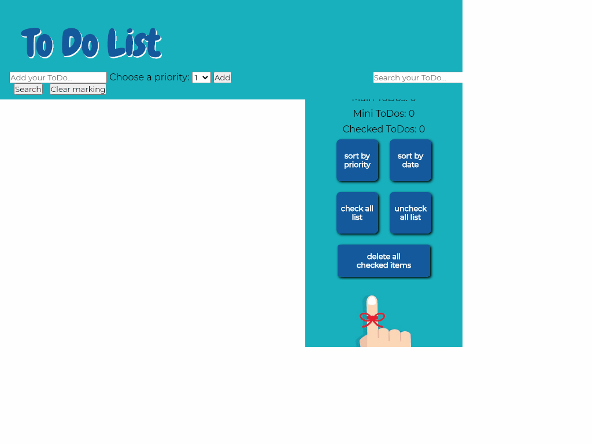
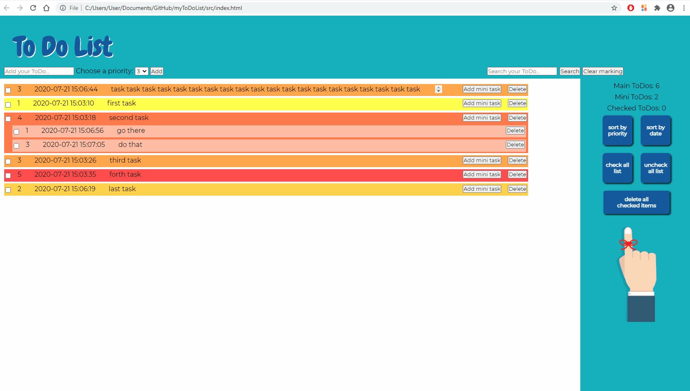

 ## bonus
 - Add new features:
   * add mini ToDos to every task
 * tick (V) tasks and mini tasks
 * (V) relations
 * sord by date added
 * coloring by priority
 * overflow long tasks
 * different screen sizes adjustments
 * favicon
- drag and drop element in a list
- Add a way to search tasks
 
 
 auto gif:
 
 
 
 my gif:
 
 
 
 my video:
 https://drive.google.com/file/d/1EEHo_BApHWFgNzUPBrd_x0Zj7wuaM1mx/view?usp=sharing
 
 
 
 
 
 
 GOOD LUCK!
